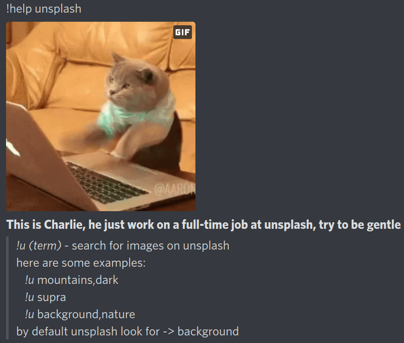
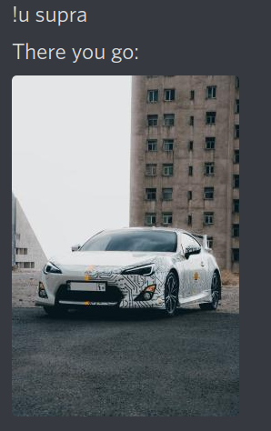
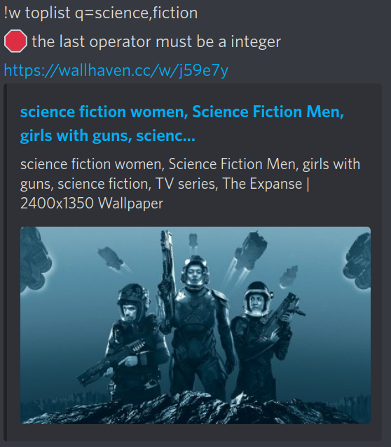
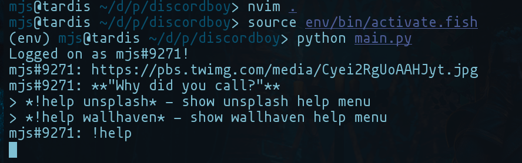

# shiny-octo-giggle 
Meet our personages 
 
### Charlie 
 
 
### Oliver 
 
 

## Installation & Run 

- git clone https://github.com/marssaljr/stunning-journey.git 
- cd stunning-journey 
- python -m venv env 
- source env/bin/activate
- pip install -r requirements.txt 
- TOKEN=XXXXXX BOT=True python main.py

## Disclaimer 
if you don't have a bot, you can simply use your account token, but it may cause a ban :(
